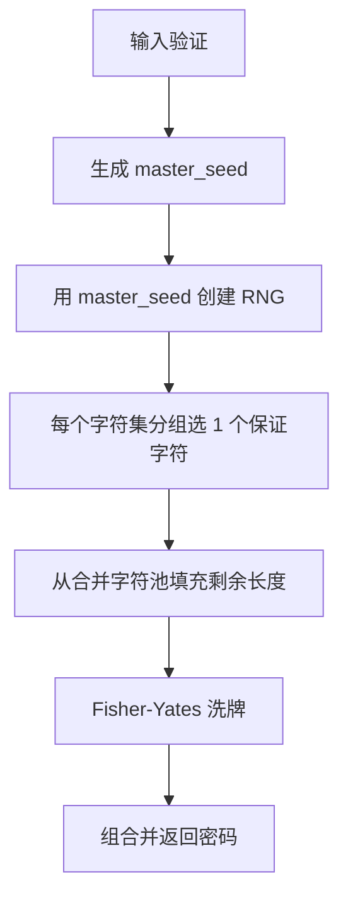

# AegixPass 算法核心设计（V2）

本文档描述 AegixPass V2 的确定性密码生成算法。所有文本输入与文件内容均按 UTF-8 处理；相同输入、相同预设和相同实现版本必须生成相同输出。

## 1. 预设结构

V2 预设 JSON 示例：

```json
{
  "name": "AegixPass - Default",
  "version": 2,
  "fastHashAlgorithm": "sha256",
  "slowHashAlgorithm": "argon2id",
  "rngAlgorithm": "chaCha20",
  "length": 16,
  "platformId": "aegixpass.takuron.com",
  "charsets": [
    "0123456789",
    "abcdefghijklmnopqrstuvwxyz",
    "ABCDEFGHIJKLMNOPQRSTUVWXYZ",
    "!@#$%^&*_+-="
  ]
}
```

| 字段 | 类型 | 说明 |
| --- | --- | --- |
| `name` | string | 预设名称，仅用于展示或识别。 |
| `version` | number | 算法版本号；V2 固定为 `2`。 |
| `fastHashAlgorithm` | string | 快哈希算法，用于预处理 `platformId` 和 `password_source`。 |
| `slowHashAlgorithm` | string | 慢哈希/密钥派生算法，用于生成 32 字节主种子。 |
| `rngAlgorithm` | string | 确定性随机序列算法，用于从主种子生成字符选择序列。 |
| `length` | number | 最终密码长度，按 Unicode 标量值字符数计算。 |
| `platformId` | string | 平台 ID；参与慢哈希输入，同时经快哈希后作为慢哈希盐值。 |
| `charsets` | string[] | 字符集分组；最终密码保证每个分组至少出现 1 个字符。 |

## 2. 算法实现等级

为保证跨平台兼容性，V2 定义“必选实现”和“可选实现”。

### 2.1 必选实现

所有兼容 V2 的实现都应支持以下算法：

| 类别 | 值 | 说明 |
| --- | --- | --- |
| 快哈希 | `sha256` | SHA-256，必选快哈希实现。 |
| 快哈希 | `sha3_256` | SHA3-256，必选快哈希实现。 |
| 慢哈希 | `argon2id` | Argon2id，必选慢哈希实现。 |
| 随机序列 | `chaCha20` | ChaCha20，必选确定性随机序列实现。 |

### 2.2 可选实现

以下算法可以由实现方按需支持。若不支持，应在解析预设或执行算法前返回明确错误，而不是静默回退到其他算法。

| 类别 | 值 | 说明 |
| --- | --- | --- |
| 快哈希 | `blake3` | 可选快哈希实现。 |
| 慢哈希 | `scrypt` | 可选慢哈希实现。 |
| 随机序列 | `hc128` | 可选确定性随机序列实现。 |

## 3. 输入验证

生成密码前必须验证：

1. `password_source` 不能为空。
2. `distinguish_key` 不能为空。
3. `version` 必须为 `2`。
4. `length >= charsets.length`，否则无法保证每个分组至少出现 1 个字符。
5. `charsets` 中每个字符串都不能为空。

建议实现额外验证：`platformId` 非空、`length` 设置合理上限、字符集总字符数不超过随机范围函数可处理的上限。

## 4. 主流程概览



算法分为 6 个阶段：

| 阶段 | 名称 | 目的 |
| --- | --- | --- |
| A | 输入验证 | 拒绝无法生成合法密码的输入。 |
| B | 生成主种子 | 将所有影响因素压缩为 32 字节 `master_seed`。 |
| C | 保证字符 | 从每个字符集分组至少抽取 1 个字符。 |
| D | 填充长度 | 从所有字符集合并池中抽取剩余字符。 |
| E | 洗牌 | 打散保证字符的位置，避免位置可预测。 |
| F | 返回 | 将字符数组组合为最终密码字符串。 |

## 5. 阶段 B：生成主种子

主种子生成是 V2 的核心：先用快哈希预处理关键输入，再用慢哈希生成固定长度种子。

### 5.1 快哈希预处理

对两个输入分别执行 `fastHashAlgorithm`：

```text
fast_hashed_salt = FastHash(platformId)
fast_hashed_password = FastHash(password_source)
fast_hashed_password_hex = LowerHex(fast_hashed_password)
```

说明：

- `fast_hashed_salt` 是 32 字节二进制值。
- `fast_hashed_password_hex` 是 64 个字符的小写十六进制字符串。
- 十六进制编码必须使用小写字母，每个字节格式为两位，例如 `{:02x}`。

### 5.2 偏移值 / 盐值定义

本算法中“慢哈希的偏移值”指慢哈希所使用的 salt/offset 输入。V2 明确定义为：

```text
slow_hash_offset = slow_hash_salt = fast_hashed_salt = FastHash(platformId)
```

也就是说：

1. 先读取预设中的原始 `platformId` 字符串。
2. 使用 `fastHashAlgorithm` 对 `platformId` 的 UTF-8 字节进行快哈希。
3. 得到的 32 字节结果直接作为慢哈希算法的盐值/偏移值。
4. 不使用原始 `platformId` 作为慢哈希盐值，也不固定使用 SHA-256；使用当前预设指定的 `fastHashAlgorithm`。

注意：原始 `platformId` 仍会进入 `input_data`，因此它同时影响慢哈希原文和慢哈希盐值/偏移值。

### 5.3 组合慢哈希原文

将输入组合为固定格式字符串：

```text
input_data = "AegixPass_V{version}:{platformId}:{length}:{fast_hashed_password_hex}:{distinguish_key}:{charsets_json}"
```

其中：

| 片段 | 内容 |
| --- | --- |
| `{version}` | 数字版本号，V2 为 `2`。 |
| `{platformId}` | 原始平台 ID。 |
| `{length}` | 最终密码长度。 |
| `{fast_hashed_password_hex}` | 主密码快哈希结果的小写十六进制字符串。 |
| `{distinguish_key}` | 用户提供的区分密钥。 |
| `{charsets_json}` | `charsets` 的标准 JSON 字符串表示。 |

`charsets_json` 必须由标准 JSON 序列化得到。例如：

```text
["0123456789","abcdefghijklmnopqrstuvwxyz","ABCDEFGHIJKLMNOPQRSTUVWXYZ","!@#$%^&*_+-="]
```

### 5.4 慢哈希派生

使用 `slowHashAlgorithm` 生成 32 字节 `master_seed`：

```text
master_seed = SlowHash(
  input = UTF8(input_data),
  salt_or_offset = fast_hashed_salt,
  output_len = 32
)
```

#### Argon2id 参数（必选实现）

| 参数 | 值 | 说明 |
| --- | --- | --- |
| `algorithm` | Argon2id | Argon2id 模式。 |
| `version` | 0x13 | Argon2 v1.3。 |
| `m_cost` | 19456 | 内存成本，单位 KiB，约 19 MiB。 |
| `t_cost` | 2 | 迭代次数。 |
| `p_cost` | 1 | 并行度。 |
| `output_len` | 32 | 输出 32 字节。 |

#### Scrypt 参数（可选实现）

| 参数 | 值 | 说明 |
| --- | --- | --- |
| `N` | 32768 | CPU/内存成本参数，即 `2^15`。 |
| `r` | 8 | 块大小。 |
| `p` | 1 | 并行化参数。 |
| `output_len` | 32 | 输出 32 字节。 |

## 6. 阶段 C：保证每个字符集至少出现一次

使用 `master_seed` 创建预设指定的确定性 RNG。随后按 `charsets` 数组顺序遍历每个分组：

1. 将当前字符集字符串按 Unicode 标量值拆分为字符数组。
2. 使用无偏范围随机数生成 `[0, chars.len())` 范围内的索引。
3. 取对应字符加入 `final_password_chars`。

这一阶段保证最终密码至少包含每个字符集分组中的 1 个字符。

## 7. 阶段 D：填充剩余长度

若 `final_password_chars.len() < length`：

1. 按 `charsets` 原始顺序拼接所有字符集，形成合并字符池。
2. 循环抽取字符，直到长度达到 `length`。
3. 每次抽取都使用同一个 RNG 实例和无偏范围随机数。

合并字符池中的重复字符会提高该字符被抽中的权重。这是当前算法的确定性行为，实现方不应擅自去重。

## 8. 阶段 E：最终整体洗牌

使用同一个 RNG 实例执行 Fisher-Yates 洗牌：

```text
for i from len(final_password_chars) - 1 down to 1:
    j = RandomRange(0, i)
    swap(final_password_chars[i], final_password_chars[j])
```

这里的 `RandomRange(0, i)` 表示生成闭区间 `[0, i]` 的无偏随机索引。洗牌的目的，是避免阶段 C 中的保证字符固定出现在密码前部。

## 9. 无偏范围随机数

范围随机数必须使用拒绝采样，避免简单取模导致的分布偏差。当前参考实现基于 `u32`：

```text
range = max
zone = u32::MAX - (u32::MAX % range)
loop:
    v = rng.next_u32()
    if v < zone:
        return v % range
```

调用方必须保证 `max > 0`。

## 10. 跨平台实现注意事项

- 文件和字符串输入使用 UTF-8。
- 字符索引基于 Unicode 标量值，而不是字节偏移。
- 快哈希结果转十六进制时使用小写字母。
- `charsets_json` 使用标准 JSON 序列化输出，不添加额外空格。
- RNG 从 32 字节 `master_seed` 初始化，不引入随机 nonce 或系统随机数。
- 阶段 C、D、E 必须共享同一个 RNG 实例，不能分别重新初始化。

## 11. 安全性说明

AegixPass V2 具有以下安全目标：

- **确定性**：相同输入始终生成相同密码，无需保存派生密码。
- **抗离线猜测成本**：Argon2id/Scrypt 增加对候选主密码的验证成本。
- **参数绑定**：`platformId`、`distinguish_key`、`length`、`charsets` 及算法选择都会影响最终结果。
- **位置不可预测**：保证字符经过最终洗牌后不固定在前部。
- **无偏抽样**：字符选择和洗牌索引使用拒绝采样，避免取模偏差。

同时需要注意：

- 快哈希不会增加弱主密码本身的熵；安全性仍主要依赖用户主密码强度和慢哈希成本。
- `platformId` 通常不是秘密，它作为盐值/偏移值用于域分离，不应被视作密钥。
- 当前 `input_data` 使用分隔符拼接，简单清晰但不是最强的结构化编码方式；未来版本可考虑长度前缀、JSON canonical form 或 CBOR 以消除字段边界歧义。
- 输出密码长度和字符集会限制最终可搜索空间；过短密码或过小字符集会降低抗猜测能力。

## 12. V2 相对 V1 的变化

V2 不再保留 V1 的 CLI 行为和配置字段。主要变化如下：

| 项目 | V1 | V2 |
| --- | --- | --- |
| 版本号 | `1` | `2` |
| 哈希配置 | 单一 `hashAlgorithm` | `fastHashAlgorithm` + `slowHashAlgorithm` |
| 洗牌配置 | 暴露 `shuffleAlgorithm` | 内部固定 Fisher-Yates，不暴露配置 |
| 主密码输入 | 原始密码直接参与拼接 | 主密码先快哈希，再以十六进制参与拼接 |
| 慢哈希盐值/偏移值 | 固定或旧式盐值处理 | `FastHash(platformId)` |
| 保证字符 | 旧式固定块抽取 | 统一 RNG 抽取 |
| RNG 使用 | 后置或分段使用 | 阶段 C、D、E 共享同一个 RNG |
